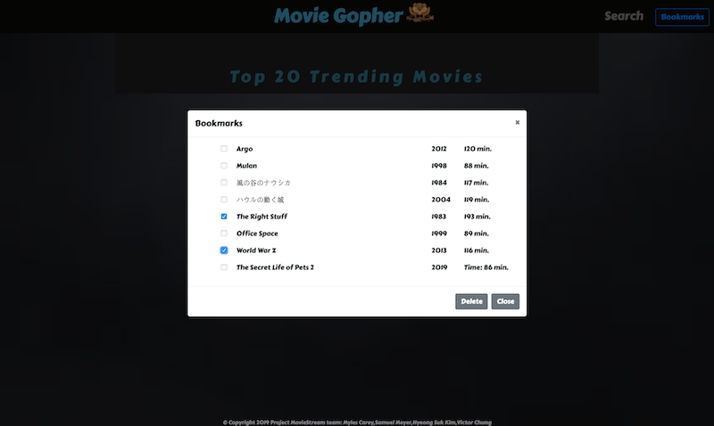

# Movie Gopher

Search assistant for Movie/Streaming titles

## Description

This web application helps a user search for Movie/Streaming content to view.
It consists of a Landing page with trending movies, a search page, detail page and a persistent save title list.

Clicking on a movie image or title within the above pages will load the detail page with a trailer and details for that movie.

## Deployed Page:
https://hyeonguw.github.io/First_Project/index.html
https://vkcgithub2019.github.io/First_Project/

## Use Example:

### 

## Screen Captures:

* Home page - trending movies
  

  
  
* Detail page - trailer section
  
  
  
  
* Detail page - information section
  

- Search page - movie search

- Search page - actor/actress search	

* Bookmarks Modal:
  

## Getting Started

### Dependencies

* best viewed laptop or desktop

### Installing

* none necessary - use browser to view

### Executing program

* open in browser 
    1. scroll thru trending movie posters and click on title poster to jump to detail page
    2. click on nav link to search page
        1. enter search criteria (movie or actor/actress) and hit search button
        2. scroll thru search results and click title to jumpt to detail page
    3. When on detail page carousel of recommended movies is shown at bottom of page - click on
       title to reload detail page with that movie
    3. Use nav links to move between landing page, search page and detail page    
    4. When on detail page add or remove title from the Save List using button
    5. When on landing page call up the Save List from navbar button
    6. Remove titles from the Save List with checkboxes and delete button.
    7. Click on a movie title in Save List to load detail page with it 

## Help

For further development details see [UseCases and Psuedo Code](UseCases-PsuedoCode.md)

## Enhancements

* list of possible enhancements
    - [x] improved detail page layout
    - [x] improved typography
    - [x] actor/actress search
    - [x] section with movie reviews (New York Time api)
    - [ ] responsiveness
    - [ ] make Save List modal available on Search and Detail pages
    
## Authors

* Samuel Meyer - sam.smeyer17@gmail.com
* Hyeong Suk Kim - whddkf2004@gmail.com
* Myles Carey - mylescarey2019@gmail.com 
* Victor Chung - victorchung998@yahoo.com

## Version History

* 0.1  Initial Release

* 1.0  Improved detail page, improved typography, actor/actress search,

    ​       New York Times synopsis / link to review

## License

* 0.1 API attribution details go here

## Acknowledgments

Thanks to beta testers - Myles Carey's 15yo & 17yo daughters and wife 

This is the link to the deployed project;
https://vkcgithub2019.github.io/First_Project/
