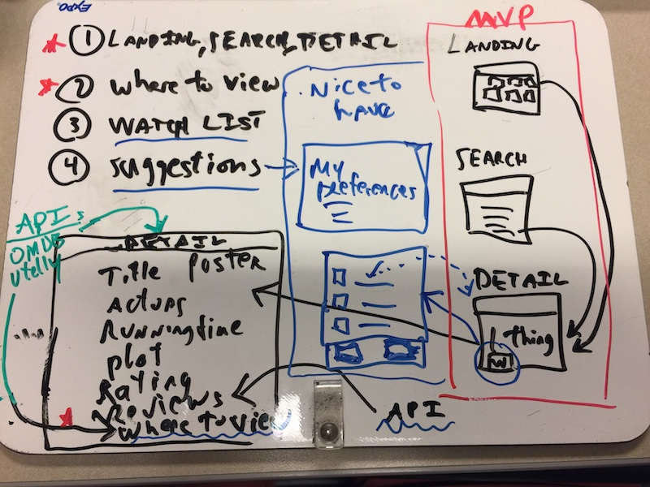
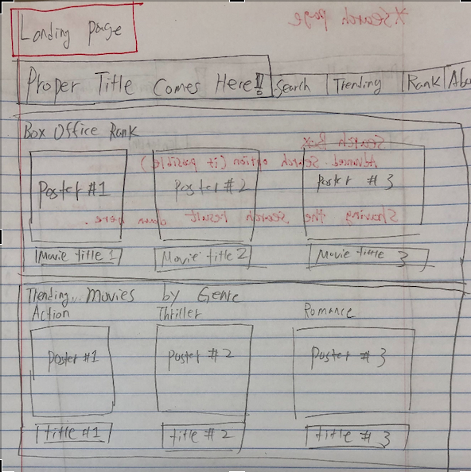
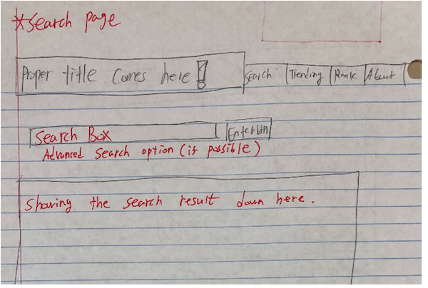
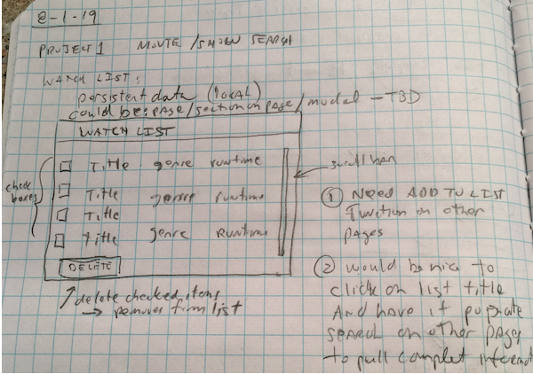
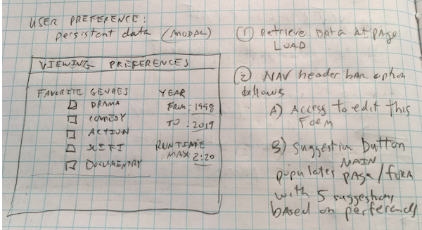

# Movie/Streaming - Search

Movie/Streaming search Web Page

## Description

This web application helps a user search for Movie/Streaming content to view.
It consists of a Landing page with top Box office and trending movies, a search page and a detail page.
Clicking on a movie within either the landing page or the search page results will bring that title up in the detail page.

The Landing page will likely have scrolling entries of top Box office and trending titles by genre.
The Search page will allow for searching by one or more critiera.

The detail page should have all things about the title and where the title can be streamed.

Nice to have features could include
1.  detail cast information
2.  reviews
3.  saved watch later list
4.  personal preferences leveraged for suggestions on the landing page 

* overall concept:
  

* Landing page:

  

* Search page:

  

* Save List modal:

  

* Preferences modal:

  

## User Stories / Use Cases

1.  landing page loads
    1. page has nav header  with title, links to search and detail pages
    2. page displays scrollable sections with top Box office movies - sections for key genres
    3. below top Box office will be simliar display with trending titles in sections by genre
    4. user scrolls thru any of the section to reveil next listing in that section
    5. sections may be limited certain number of titles - TBD
    6. user clicks on title in on the sections
        1. active page switches to detail page
        2. content is loaded for the clicked title 
    7. user clicks on search link 
        1. active page switches to search page
        2. no search terms loaded 
        3. if there were previous search terms should we have saved them and now re fill form?
    8. user clicks on detail page
        1. re-direction to the detail page 
        2. show details from the last time user triggered detail page
        3. if detail page hasn't been visited in this session then detail will be empty content
        
2.  user visits Search Page
    1. page has nav header with title, links to landing and detail pages
    2. page has search form, search button and are to display scrollable results
    3. search terms include:  title, subject, genre (with drop down list), release year range, rating (pg, pg13, etc.), actor/actress
    4. user clicks search button 
        1.  form validation occurs and informs user of any errors
            1. minimum entries should be Title, subject or genre (TBD dependent on API)
            2. validate errors:
                1. title, subject and genre all blank
                2. bad year range
        2. valid search criteria entered
            1. results window is populated with some number of results (should we have a limit or maybe make a limit part of the search critiera?)
            2. results will be scrollable, result titles will be links
            3. if no results - show message
        3. user clicks on result title
            1.  page is redirected to the detail page
            2.  content loaded for clicked title 
    5. user clicks landing page nav link
        1. re-directed to the landing page which re-loads
    6. user clicks detail page nav link
        1. re-directed to the detail page which reload previous detail content (if previously populated)

3.  User clicks link to Detail page or re-directed to Detail page from landing or search pages
    1. page has nav header with title, links to landing and search pages
    2. if being re-directed from landing page title click or search result title click show details for the title
    3. user sees detail including
        1. title, genre, rating (pg, pg13, etc.)
        2. release year, running time, cast list
        3. ratings
        4. where title can be streamed (Netflix, Amazon, Amazon-prime, iTunes)
    4. user clicks landing page nav link
        1. re-directed to the landing page which re-loads
    5. user clicks search page nav link
        1. re-directed to the search page which reload previous search fields (should we do this?)

4.  Note - API usage usually requires visible attribution for each API - likely put these in a page footer

5.  Nice to Have (only look at these when above MVP(Minium Viable Product) is finished)
    1. Detailed Cast information on Detail page
        1. details TBD
    2. managable watch later list
        1. details TBD
    3. user preferences to drive landing page suggestions 
        1. detail TBD

### Psuedo Code - details TBD

1. Global
    1. Variables
    2. Functions

2. Objects/Classes
    1. TBD
        1. Properties
            1. TBD
        2. Methods
            1. TBF

3. Events/Listeners/Timers
    1. TBD
         
